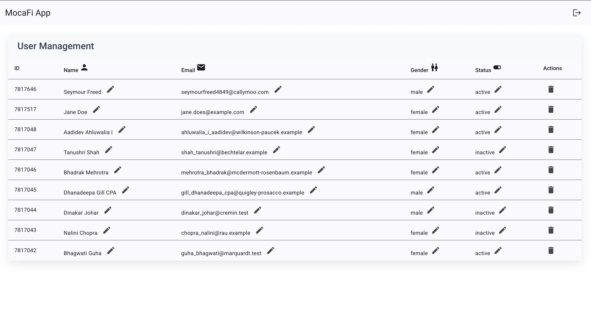

# Angular User CRUD Application

This is a modern Angular 19 application built with Angular Material for high performance. It enables CRUD operations with users using the Go REST API (https://gorest.co.in).



## Features

- Login interface where any credentials will work for testing purposes
- User Management: Create, Read, Update, Delete operations
- Form validations for all inputs
- API integration with Go REST API
- Angular Material design components

## How It Works

The app simulates an authentication flow using a mock login system. There's no backend database for user authentication - any email and password combination will work for testing purposes. The app uses localStorage to maintain the session state.

After logging in, you'll see the users table where you can view all users from the Go REST API. You can edit user properties or delete users directly from this interface.

Want to add a new user? Just hit the sign-up button and fill out the form. This will create an actual new user in the Go REST API database.

You can log out anytime by clicking on the menu in the top bar.

## Setup

1. Clone the repository:
   ```
   git clone github.com:passsionforprogramming/angular_19_fun.git
   ```
2. Install dependencies:
   ```
   npm install
   ```
3. Replace the API token in `src/app/api.service.ts` with your token from https://gorest.co.in.
4. Serve the application:
   ```
   ng serve
   ```
5. Open your browser at http://localhost:4200.

## Deployed Solution

[Deployed Solution Link](https://angular-fun.netlify.app/)

## License

MIT
